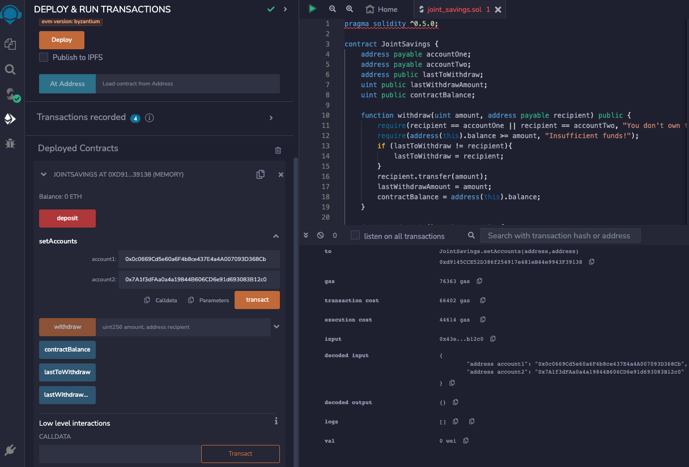

# Joint Savings Account

## Overview

A fintech startup company is revolutionizing the finance industry by developing a cutting-edge, Ethereum-compatible blockchain that facilitates seamless connections between financial institutions. As part of the team, I am building a smart contract that will automate the creation and management of joint savings accounts. This smart contract will empower users to collaborate and control a shared savings account while adhering to strict security and transparency measures.

The smart contract will enable the creation of joint savings accounts by accepting two user addresses as inputs. These addresses will serve as the account controllers, allowing them to execute specific functions within the contract.

## What I have Created

* A completed Solidity `JointSavings` smart contract.

* A folder named `Execution_Results` that contains all execution result images. These images confirm that the deposit and withdrawal transactions, which are designed to test the `JointSavings` functionality in the JavaScript VM, worked as expected.

## Compile and Deploy the Contract in Remix VM Merged (used to be JavaScript VM)

1. I have successfully compiled the smart contract.

2. In the “Deploy & Run Transactions” pane, “Remix VM (Merged)” is selected as the environment.

3. I have deployed my smart contract, and then confirmed that it successfully deployed.

## Interact with the Deployed Smart Contract

Now that the contract is deployed, it’s time to test its functionality.

To interact with my deployed smart contract, I have completed the following steps:

1. Used the `setAccounts` function to define the authorized Ethereum addresses that will be able to withdraw funds from the contract.

2. Tested the deposit functionality of the smart contract by sending the following amounts of ether. After each transaction, I have used the `contractBalance` function to verify that the funds were added to my contract:

* Transaction 1 - Send **1 ether** as wei.

* Transaction 2 - Send **10 ether** as wei.

* Transaction 3 - Send **5 ether.**

3. All funds have been successfully deposited into my contract. I have tested the contract’s withdrawal functionality by withdrawing 5 ether into `accountOne` and 10 ether into `accountTwo`. After each transaction, I have used the `contractBalance` function to verify that the funds were withdrawn from my contract. I have also, use the `lastToWithdraw` and `lastWithdrawAmount` functions to verify that the address and amount were correct.

* Withdrawal 1 - **5 ether** into `accountOne`, Account balance, `lastToWithdraw` and `lastWithdrawAmount` logs. 

* Withdrawal 2 -  **10 ether** into `accountTwo`, Account balance, `lastToWithdraw` and `lastWithdrawAmount` logs. 
